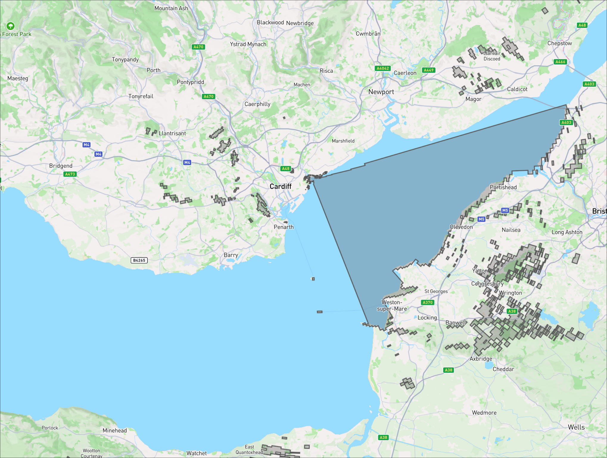
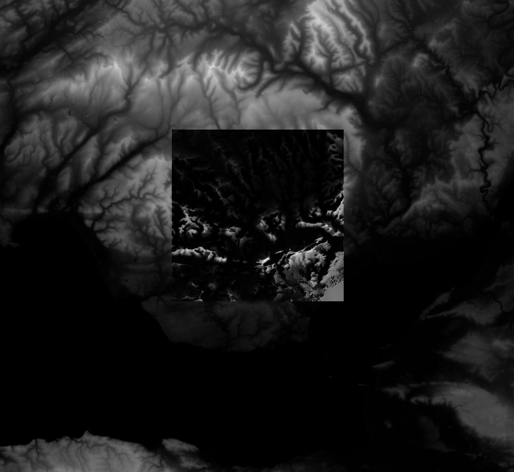

# Total Viewshed Calculator
Calculates the total visible surface from every point of a given terrain. For example, the viewshed for the summit of a mountain will be large and for a valley it will be small. There are other viewshed calculators, most notably for [Arcgis](http://pro.arcgis.com/en/pro-app/tool-reference/3d-analyst/viewshed.htm), but they only calculate single viewsheds for a specific point. The algorithm used here however takes advantage of the computational efficiency gained by calculating *all*, therefore the total, viewsheds for a given region.

This is an example of a single viewshed in Cardiff Bay, Wales, created by this application:


This is an example of a heatmap of a total viewshed surface (TVS) area (the darker square in the middle). The background is a simple heatmap visualisation of elevation (the higher the whiter). It is from the same Cardiff Bay area as above. Notice how the TVS features are similar but different to the underlying elevation data. It still represents peaks and valleys, but for example its southern side is brighter because it can see further into the lower regions of the river channel. The TVS heatmap is smaller because it doesn't calculate values at the edges of the elevation data, it can't calculate the visibility of regions it is not given data for.



## Algorithm
This project is based on the work of Siham Tabik, Antonio R. Cervilla, Emilio Zapata, Luis F. Romero in their
paper _Efficient Data Structure and Highly Scalable Algorithm for Total-Viewshed Computation_: https://ieeexplore.ieee.org/document/6837455

However it notably improves on it by using Band of Sight 'shapes' rather than calculating the coordinates of every single Band. This has massive space improvement and therefore speed improvement. It also reduces the need for a linked list, further improving the simplicity of the algorithm.

There's also a new paper by the same author from 2021 that seems to focus more on parallelism https://arxiv.org/pdf/2003.02200.

## DEM file format
Currently only the [`.bt` file format](http://vterrain.org/Implementation/Formats/BT.html) is supported.
* It must be perfectly square.
* Must be in an AEQD projection whose anchor is the centre of the tile.
* The tile's extent must be set so that both the bottom-left and top-right are repurposed to define the lon/lat coordinates of the centre.
* All points must be the same metric distance apart.

Example of how to repurpose the extent for the AEQD centre:
`gdal_edit -a_ullr $CENTER_LON $CENTER_LAT $CENTER_LON $CENTER_LAT path/to/tile.bt`

## Usage
The best source of elevation data I have found is here: https://www.viewfinderpanoramas.org/Coverage%20map%20viewfinderpanoramas_org3.htm It's mostly in the `.hgt` format, but can easily be converted to `.bt` using `gdal_translate`.

### Total Viewshed Surfaces
Example: `RUST_LOG=trace cargo run --release -- compute caerphilly_100km_aeqd_100m.bt --scale 100 --rings-per-km 3`

A heatmap of total viewshed surface areas will be saved to `./heatmap.png`. The path can be changed with `--output-dir path/to/dir`. Note that the same image file is updated for every sector angle, so you can watch the details improve as the computatioin progresses.

The heatmap is generally only of the central third of the input file. You can see an elevation heatmap of the original here: https://dwtkns.com/srtm30m, you should be able match features from its central area.

### Individual Viewsheds
Once you have run the above computations you will have access to what's called "ring data". This can be used to reconstruct _any_ viewshed from within the TVS. Example:
`RUST_LOG=trace cargo run --release -- viewshed output -- -3.1230,51.4898`

```
* Total Viewsheds
  Generate _all_ the viewsheds for a given Digital Elevation Model, therefore the total viewsheds.

  Usage: tvs <COMMAND>

  Commands:
    compute   Run main computations
    viewshed  Reconstruct a viewshed
    help      Print this message or the help of the given subcommand(s)

  Options:
    -h, --help
            Print help

    -V, --version
            Print version


* Compute
  Run main computations

  Usage: tvs compute [OPTIONS] <Path to the DEM file>

  Arguments:
    <Path to the DEM file>
            The input DEM file. Currently only `.hgt` files are supported

  Options:
        --max-line-of-sight <The maximum expected line of sight in meters>
            The maximum distance in metres to search for visible points. For a TVS calculation to be truly correct, it must have access to all the DEM data around it that may possibly be visible to it. However, the further the distances searched the exponentially greater the computations required. Note that the largest currently known line of sight in the world is 538km. Defaults to one third of the DEM width

        --rings-per-km <Expected rings per km>
            The maximum number of visible rings expected per km of band of sight. This is the number of times land may appear and disappear for an observer looking out into the distance. The value is used to decide how much memory is reserved for collecting ring data. So if it is too low then the program may panic. If it is too high then performance is lost due to unused RAM

            [default: 5]

        --observer-height <Height of observer in meters>
            The height of the observer in meters

            [default: 1.65]

        --backend <The method of running the kernel>
            Where to run the kernel calculations

            [default: vulkan]

            Possible values:
            - cpu:    Conventional CPU computations. The slowest method
            - vulkan: A SPIRV shader run on the GPU via Vulkan
            - cuda:   TBC

        --output-dir <Directory to save output to>
            Directory to save results in

            [default: ./output]

        --scale <DEM scale (meters)>
            Override the calculated DEM points scale from the DEM file. Units in meters

        --process <What to compute>
            What to compute

            [default: all]

            Possible values:
            - all:                   Calculate everything
            - total-surfaces:        Compute the total visible surfaves for each computable DEM point and output as a heatmap
            - longest-line-of-sight: Find the longest line of sight for each computable point and output as a `GeoTiff`
            - viewsheds:             Compute all the ring sectors saving them to disk so that they can be used to later reconstruct viewsheds

    -h, --help
            Print help (see a summary with '-h')


* Viewshed
  Reconstruct a viewshed

  Usage: tvs viewshed <Path to existing output directory> [COORDINATES]...

  Arguments:
    <Path to existing output directory>
            Directory where compute output was saved

    [COORDINATES]...
            Coordinates to reconstruct viewsheds for

  Options:
    -h, --help
            Print help

```

## Building Vulkan shader
* Install `cargo-gpu`: `cargo install --git https://github.com/rust-gpu/cargo-gpu cargo-gpu`
* Compile: `cargo gpu build --shader-crate crates/shader`

Note that the pre-compiled shader already comes with the source code (at `crates/shader/total_viewsheds_kernel.spv`). So you only need to compile the shader if you're developing it.

## License
The license is the same as that used for the original paper's sample code: https://github.com/SihamTabik/Total_Viewshed

## Notes

### View Finder Panoramas by Jonathon de Ferranti
The holy grail of DEM data. He's done all the work to clean ad void fill the DEM data
http://www.viewfinderpanoramas.org

### Open Topography
https://opentopography.org
Seems to be an effort to bring everything together. But doesn't seem to clean up the data like View Finder does.

### SRTM 1 arcsecond data
Apparently this is the highest resolution and most comprehensive DEM data:
https://e4ftl01.cr.usgs.gov/MEASURES/SRTMGL1.003/2000.02.11/SRTMGL1_page_1.html

Map of coverage (80%) and total size of data (35GB)

User guide: https://lpdaac.usgs.gov/documents/179/SRTM_User_Guide_V3.pdf

### GDAL support for the .hgt format
https://gdal.org/drivers/raster/srtmhgt.html

### Claim of Krygystan 538km LoS and cool 3D graphic
https://calgaryvisioncentre.com/news/2017/6/23/tdgft1bsbdlm8496ov7tn73kr0ci1q

### Errors caused by AEQD projection
To do all the viewshed calculations we assume the DEM data is projected to an AEQD projection with an anchor in the centre of the tile. For the longest lines of sight on the planet, ~500km, the worst case errors caused by the projection can reach ~0.0685%. This error is only relevant to viewsheds at the edge of the computable area of the tile, therefore those viewsheds around 500km from the centre of the tile. Therefore depending on your usecase you may want to choose different bounds for your tile so that critical regions are nearer the centre and so suffer less errors.

### Misc
* https://crates.io/crates/srtm_reader

## Further Reading
* https://en.wikipedia.org/wiki/Long_distance_observations

## TODO
* [ ] Why is computing 0° so much faster than computing 1° and 45° so much faster than 46°??
* [ ] `--rings-per-km` doesn't seem intuitive and doesn't give an informative error when it fails.
